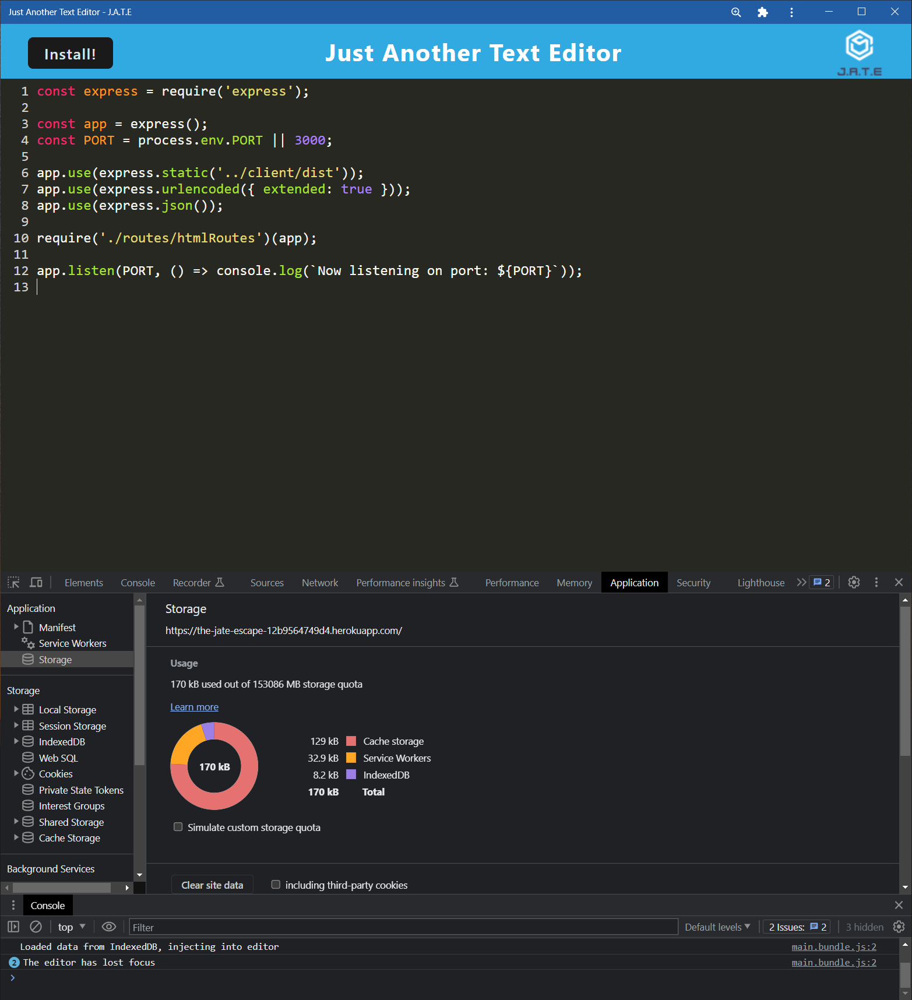

# The JATE Escape

## Table of Contents

- [Description](#description)
- [Installation](#installation)
- [Usage](#usage)
- [Questions](#questions)
- [License](#license)

### Deployed Heroku Link: https://the-jate-escape-12b9564749d4.herokuapp.com/

## Description

This app is a simple text editor with code that I repaired as part of an assignment for a full stack web dev bootcamp course. It has simple syntax highlighting for JavaScript and is a fully installable PWA using webpack

## Installation

To install, simply click the "install" button on the page after loading

## Usage

This app can be used for simple text editing. The edited text is saved to the local cache, so it will be available upon reloading

## Questions

You can contact me with questions in the following places: 

Github Profile: https://github.com/TrueWillB 

## License

This repo and all of its contents operate under MIT License. For details, please view the LICENSE file in the repository or click the badge: 
